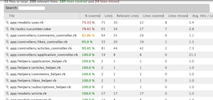
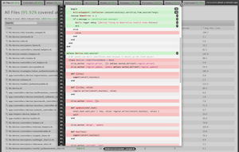
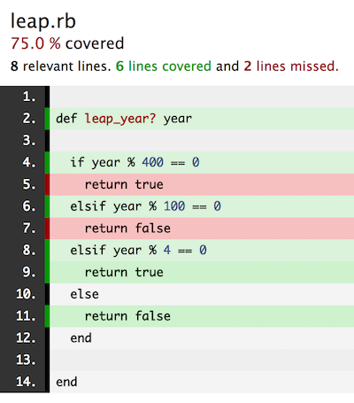

# Code Coverage Using SimpleCov

**Code coverage** is a term that is used to describe how much application code is exercised when a particular test suite is run.  By making sure your test suite covers a high percentage of your code suggests that your code has a lower risk of bugs.

## Enter SimpleCov

The [SimpleCov](https://github.com/colszowka/simplecov) gem allows you to get a report on the code coverage of your tests.  

To add SimpleCov to your test suite first run `gem install simplecov` in the terminal.  

Then in your spec file add the following lines **to the top** of the file.

```ruby
require 'simplecov'
SimpleCov.start
```


## Code Coverage Reports

SimpleCov places a report inside a directory helpfully named `coverage` which has an HTML page listing the code coverage.  







## Sample SimpleCov Run

Thinking back to Weekend Warrior, if we have this leap_year? method.

```ruby
def leap_year? year
  if year % 400 == 0
    return true
  elsif year % 100 == 0
    return false
  elsif year % 4 == 0
    return true
  else
    return false
  end
end
```

And this testing suite:

```ruby
require 'simplecov'
SimpleCov.start

require 'minitest/pride'
require 'minitest/autorun'


require_relative 'leap'

describe "Leap Year Test" do
  it "Test on 1996" do
    expect(leap_year?(1996)).must_equal true
  end

  it "Checking non leap year" do
    expect(leap_year?(1997)).wont_equal true
  end
end
```

We get the following:



Notice that it's telling us we're not testing two of the conditions.  


## So If I have 100% Coverage I'm Good Right?  No Bugs?

Ummm... no.  SimpleCov measures which statements were executed via your tests, not every combination of values possible.  So bugs can creep in.  However a good amount of code coverage does provide you with insights into your testing.  It can:

-  Help you identify code that may be unnecessary.
-  Help you identify "blind spots" testing.

So code coverage is a tool that's a useful indicator of the test quality, but having high code coverage doesn't guarantee that your testing is perfect.  It can be especially useful if you don't write tests first, as it can be easy to forget to test some functionality and code coverage reports can help you identify that.  Some teams require a certain percentage of code coverage so it's a good concept to know.  


### Exercise

Add code coverage to your Alouette Weekend-Warrior exercise.      


## Resources
- [SimpleCov Github Page](https://github.com/colszowka/simplecov)
- [SimpleCov: how to add it to your tool belt and (the 5) why(s)](http://www.mariusbutuc.com/simplecov-tool-for-coverage-analysis)