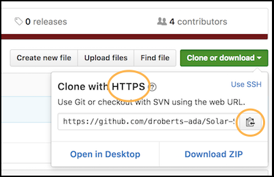
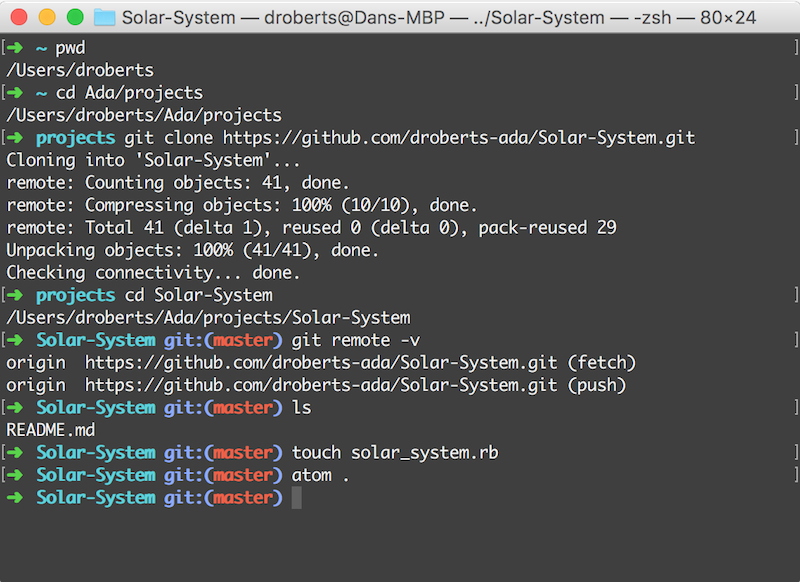

# GitHub and the Command Line

So far, we've only used git locally to keep track of files on our computer. However, much of the power of git is in moving files from place to place, and enabling collaboration between people. So let's learn about how to do some of that!

You might want to bookmark this page.

## Learning Goals

At the end of this lesson you should be able to...

* Pull the contents of a GitHub repository to your computer
* Push your changes back to GitHub

## Cloning a GitHub Repository

This is the procedure you'll follow at the beginning of almost every project you work on.

1. Fork the repository under your own GitHub account
  
1. Check the address bar and repo title, and verify you're now on your fork
  
1. In the middle left, just above the list of files, click the green `Clone or Download` button
  
1. Copy the URI that pops up (or click the `Copy to clipboard` button)
  
1. Open a terminal, and navigate to your `projects` folder
1. _Clone_ your fork of the repository to your computer using the `git clone` command:
  ```
  $ git clone <paste the URI here>
  ```
1. The `git clone` command should have created a directory with the same name as the repo. `cd` into it.
1. Proceed to work on your project. Remember to commit regularly!
  

You won't need to run `git init` in a cloned project - that's something you only do if you're starting from scratch.

### Remotes

In git, repositories on other computers are called _remotes_. When you ran `git clone`, part of the setup process involved adding a remote called `origin`, which points to your fork of the project on GitHub. This will be important later.

You can see a list of all remotes using the `git remote -v` command (the `-v` is short for _verbose_):

```
$ git remote -v
origin	git@github.com:droberts-ada/Solar-System.git (fetch)
origin	git@github.com:droberts-ada/Solar-System.git (push)
```

You should see two identical entries, one for `fetch` and one for `push`. The URI should have your GitHub username and the repo name in it, and should **not** contain `Ada-CX`.

## Pushing Local Changes to GitHub

Once you've finished a project, you need to get your work up to GitHub somehow so you can turn it in. This is done using the `git push` command.

1. Make some changes
  ```
  $ echo "fixin boogs erry day" >> project.rb
  ```
1. Add the file
  ```
  $ git add project.rb
  ```
1. Commit your changes
  ```
  $ git commit -m "Fixed that tricky bug"
  ```
1. Check your work
  ```
  $ git log   # should show your recent commit
  ```
1. Check the output of `git status`
  ```
  $ git status
  On branch master
  Your branch is ahead of 'origin/master' by 1 commit.
    (use "git push" to publish your local commits)
  nothing to commit, working tree clean
  ```
  This tells us two things:
  * All our local changes have been committed
  * We have one commit locally that doesn't exist on the `origin` remote (a.k.a. your fork on GitHub).
1. _Push_ your changes back to GitHub
  ```
  $ git push
  ```
1. Check GitHub, where you should now see your changes.

Congratulations - you just executed a real-world git workflow! You're now ready to submit your project via the same PR process we used before.

A few notes before we conclude:

* You can push many commits at once
* You can make many pushes - you don't have to wait until your project is completely finished
* You should push to GitHub often - your laptop's hard drive is much more likely to fail than their servers. I try to commit and push at the end of each coding session, so I've got a backup just in case.
* Once you've submitted a PR, any new pushes to your fork will automatically update the PR

## What Did We Accomplish?

* _Clone_ a repository from GitHub to our computer
* _Push_ our changes back up to GitHub

## Additional Resources

* [GitHub's very readable getting started guide](https://help.github.com/)
* [Git documentation](https://git-scm.com/book/en/v2/Git-Basics-Getting-a-Git-Repository) (much of chapter 2 pertains here)
