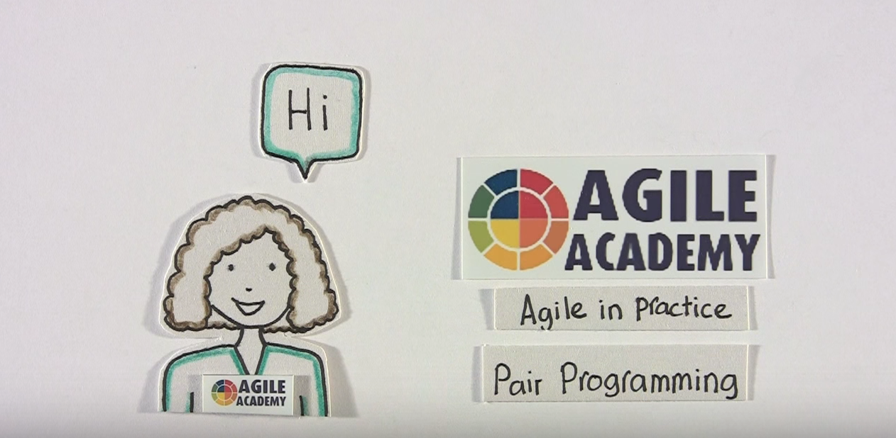

# Programming Techniques
Different contexts call for different methods of programming: sometimes it's best to pair, and sometimes it's best to work solo.

# Pair Programming

## What is Pair Programming?
Pair programming is a method of programming in which two people work together at one keyboard. One person, "the driver", types at the keyboard. The other person, "the observer" (or "navigator") reviews each line of code as it is typed, checking for errors and thinking about the overall design.

Some benefits you can expect: better code (simpler design, fewer bugs, more maintainable), higher morale (more fun!), shared knowledge throughout your team (both specific knowledge of your codebase and general programming knowledge), better time management, higher productivity.

Both programmers work on one computer throughout this process.

**Driver:**  
Controls the mouse/keyboard  
Deals with the details

**Navigator:**  
Thinks higher level  
Watches for typos, logical errors

## Guidelines
- Make sure to regularly rotate roles!
- _Anyone_ can change _anything_
- Be patient, respectful, and open
- Resolve disagreements civilly

## Why Pair Programming?
#### Code
- Fewer bugs (15-20%)
- Better code quality
- Better design

#### Programmers
- Increases knowledge sharing
- Reduces bad programming habits
- Improves focus
- Improves communication skills

#### Team
- Increases knowledge sharing
- Increases “bus factor”

## Steps for Successful Pairing

1. Start with a reasonably well-defined task before you sit down
2. Agree on one tiny goal at a time
3. Rely on your partner, support your partner
4. Talk a lot!
5. Sync up frequently
6. Take a moment to celebrate as you complete tasks and overcome problems
7. Switch roles often - at least every half hour

Note: Borrowed from [Wiki How](http://www.wikihow.com/Pair-Program)  

# Solo Programming

Sometimes it's best to work solo. Let's talk about some Do's and Dont's of working solo.

## Rubber Ducking

[Rubber Duck Debugging, or Rubber Ducking](https://en.wikipedia.org/wiki/Rubber_duck_debugging) is a method of debugging code. It describes the idea that sometimes the best way to debug code is to talk things through out loud, and that sometimes talking out loud to a rubber duck will do. Sometimes, you can discover the solution to your problem just by trying to explain your code out loud.

The idea of Rubber Ducking is common and often joked about, to the point that many software development teams will provide literal rubber ducks to developers.

## Spiking

In Agile software development methodologies (a specific set of processes that guides software development on large teams), a "spike" is a task or a piece of work that prioritizes exploration and understanding over writing clean code or tests for a short amount of time. When you need to work on a "spike" rather than on project requirements directly, you're saying that you're going to spend a specific short amount of time exploring solutions and possibilities. Spikes tend to have an attitude making a "proof of concept," with the intention to write potentially messy code now, and spend time writing more intentional (better, TDD, more readable, usable, flexible) code later. Agile software development has a specific definition on "spikes" that give guidance over expected outcomes within specific metrics.

Sometimes it's necessary to work on a spike for a brief amount of time. However, when you begin on this endeavor, keep the following things in mind:
- Determine what you're trying to explore from the beginning
- Give yourself a time limit of less than a few hours

Usually, when a person or pair works on a spike, they plan to discard the code after the exploration and learning has been done.

Spikes and exploring code in similar ways are only **temporary** times of deprioritizing code quality. Your main way of writing code should be a continual and close loop of writing and refactoring.

## Things to Avoid

### The Silo

When you're working on a team, there's a tendency for individuals to disproportionately understand one part of the system more deeply than the others. A "Silo" describes an individual on a team who "has all the knowledge" over one part of the software. While specialization is not a bad thing, the presence of an individual who disproportionately knows how a piece of software works while the rest of the team does not, can lead to a development process full of bottlenecks and inefficiencies.

On large software development teams, the presence of one or more knowledge silos can lead to:
- bottlenecks
- a project more vulnerable to risks
- reducing team cohesion

*[(Source)](https://spin.atomicobject.com/2015/11/12/software-silos/)*

Pair programming is one technique that directly combats these problems and tendencies, through sharing knowledge in a productive way.
