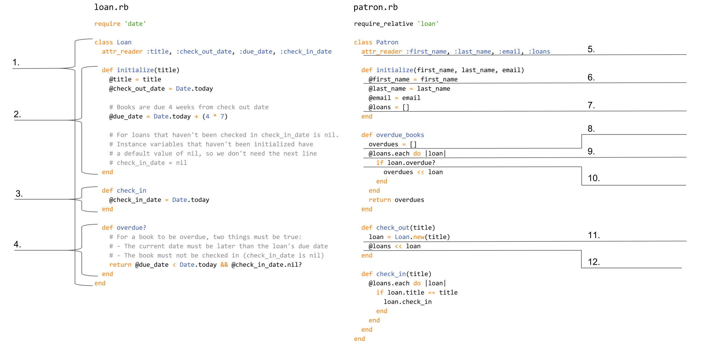

# Worksheet: Classes Vocabulary

## Learning Goals

- Read and understand unfamiliar Ruby code
- Quickly identify code elements associated with defining and using classes

## Loans and Patrons

The below code might be part of a library database, tracking which books have been loaned out to which patrons.

This code is in an image so that we can highlight specific parts of it. [If you want a text version, use this gist](https://gist.github.com/droberts-ada/e1924d86244328102e98c835cc3e2aea).

<!-- Instructors: source for this image is at https://docs.google.com/presentation/d/1Ro-4od5VZLV7NR_T8uvg5wZZlxl6WtilH6sWXTcl8cI/edit#slide=id.p -->

## Object Vocab

Many components of the code have been labeled! Your task is to take the vocab from the table below, and identify the part or parts of the code where that term applies. Each term may apply to multiple parts of the code, and each part of the code may contain multiple terms.

Letter | Term
---    | ---
A      | Initializing an instance variable
B      | Reading an instance variable
C      | Modifying an instance variable
D      | Local variable
E      | Class definition
F      | Helper method
G      | Creating an instance of a class
H      | Constructor definition
I      | Instance method definition
J      | Calling an instance method
