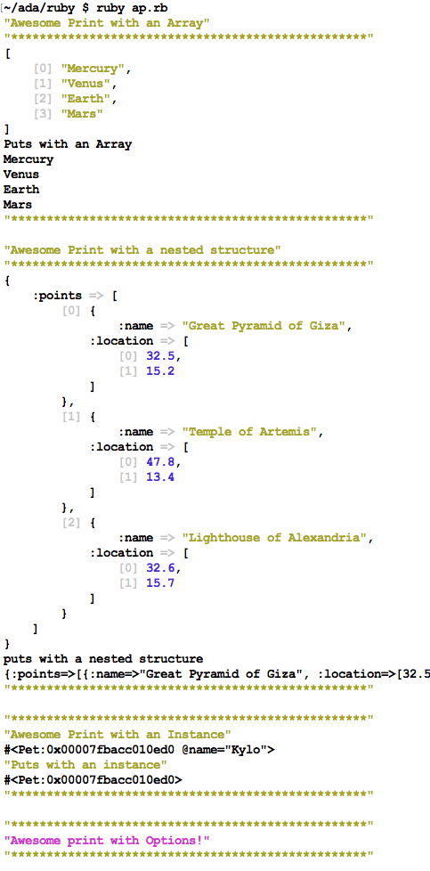

# An Introduction to Ruby Gems

## Learning Goals
By the end of this lesson you should:
- Be able to add a gem to your computer.
- `require` a gem and use it in your projects
- Have a basic grasp of how to use:
  - Awesome Print
  - Colorize
  - Pry
  - Faker

## Introduction
Gems are what other languages call a library. They are packaged code that can be shared and distributed. Most gems are distributed using [RubyGems.org](https://rubygems.org/). A Gem will contain one or more
Ruby Classes, just like the ones you've been creating. We will look at a few gems in particular

- [Awesome Print](https://rubygems.org/gems/awesome_print/versions/1.8.0)
- [Colorize](https://rubygems.org/gems/colorize)
- [Pry](https://rubygems.org/gems/pry/versions/0.11.3)
- [Faker](https://rubygems.org/gems/faker/versions/1.8.7)

The pages linked above are the rubygems sites for the gems, and you can sometimes find useful documentation here, but more often the updated documentation is on their github pages.  

## Installing Gems
Installing gems is super easy! We do it right from the Terminal. To install the gem `awesome_print`, do `$ gem install awesome_print`. You can see all the gems currently installed using `$ gem list`.

## Requiring Gems
Since gems are external Ruby libraries, they are not included in core Ruby. To use the code provided by the gem, we `require` it in our code base. This can be done at the top of any Ruby script, file, or in `irb`:

```ruby
require "awesome_print"
```

### Example: Using the `awesome_print` gem.
Generally the github page for a gem is the best place to go to get started. Let's check out the [awesome_print gems' page](https://github.com/awesome-print/awesome_print). Under _usage_ we see some common examples of how to use this gem.

In general `awesome_print` is a a great tool for printing debugging messages to the console because of it's syntax highlighting and how it provides information beyound `puts`.  

```ruby
require 'awesome_print'

# Awesome_print has Waaay too many features to demonstrate in one example.  
# We will stick to the basics.

# Comparing ap to puts

sample_array = ["Mercury", "Venus", "Earth", "Mars"]
ap "Awesome Print with an Array"
ap sample_array
puts "Puts with an Array"
puts sample_array


nested_structure = {
  points: [
    {
      name: "Great Pyramid of Giza",
      location: [32.5, 15.2]
    },
    {
      name: "Temple of Artemis",
      location: [47.8, 13.4]
    },
    {
      name: "Lighthouse of Alexandria",
      location: [32.6, 15.7]
    }
  ]
}

ap "Awesome Print with a nested structure"
ap nested_structure
puts "puts with a nested structure"
puts nested_structure

ap "Awesome print with an object"
class City
  def initialize(name)
    @name = name
  end
end

my_city = City.new("Seattle")
ap "Awesome Print with an Instance"
ap my_city
ap "Puts with an instance"
puts my_city

ap "Awesome print with Options!", color: {string: :purpleish}
```


**Exercise** Try to add an option to an `ap` statement.  Check the [github page](https://github.com/awesome-print/awesome_print)  for instructions

## Colorize
Next let's take a quick look at the colorize gem.

```bash
gem install colorize
```

Look at the [usage section](https://github.com/fazibear/colorize) of the github page.

```ruby
require "colorize"

puts "This is blue".colorize(:blue)
puts "This is light blue".colorize(:light_blue)
puts "This is also blue".colorize(:color => :blue)
puts "This is light blue with red background".colorize(:color => :light_blue, :background => :red)
puts "This is light blue with red background".colorize(:light_blue ).colorize( :background => :red)
puts "This is blue text on red".blue.on_red
puts "This is red on blue".colorize(:red).on_blue
puts "This is red on blue and underline".colorize(:red).on_blue.underline
puts "This is blue text on red".blue.on_red.blink
puts "This is uncolorized".blue.on_red.uncolorize
```

Relatively straight-forward, but neat!

## Pry

Pry is an amazing gem which serves a couple of purposes.

1.  It can replace irb to serve as a REPL.  This is advantageous because it formats code nicely.
2. It can be used in debugging to halt your program and let you interact with it in a REPL.  

To install `pry`
```bash
gem install pry
```

You can use `pry` to halt your program and open up a REPL to explore your running program with the command `binding.pry`

```ruby
# test_pry.rb
require "pry"

num = 0
while num >= 0
  num += 1
  binding.pry
end

```

Now running your program with `ruby test_pry.rb` will result in this:
```
ruby test_pry.rb

From: /Users/chris/ada/ruby/test_pry.rb @ line 6 :

    1: require "pry"
    2:
    3: num = 0
    4: while num >= 0
    5:   num += 1
 => 6:   binding.pry
    7: end

[1] pry(main)>
```

You can then enter irb-like commands like: `num` to get the current value of the variable in the program.  You can enter `exit` to exit the current binding and the program will halt again the next time it encounters  `binding.pry`.  When you finish you can exit the entire program with `exit-program`.  We will go further into `pry` at a later date and you are welcome to [research](http://pryrepl.org/) the gem.

### Replacing irb

You can have Pry replace irb by editing your bash profile with `atom ~/.profile` and adding

```bash
alias irb='pry'
```
to the end of the file.  Now the next time you open the terminal typing `irb` will instead invoke `pry`!

## Faker
Quite often as you are building a program you will need demo/fake data.  This could be names, addresses, numbers, etc.  For this we often turn toward `faker`.  This gem is designed to generate a variety of sample information.  To learn more, check out it's [github page](https://github.com/stympy/faker).

You can install `faker`
```bash
gem install faker
```

**Exercise** After having seen us use `pry`, `colorize` and `awesome_print`, write a small program with your seatsquad that will store 10 fake names in an array and print them to the terminal using the gem to get random names.  Refer to the Github page's README for how.  

## Using Gems in your projects

You are welcome to use gems in your projects.  However no gem will be required, unless specified in the project.  Make the names fun if you can!

## Other Great Gems!
- [Money](http://rubymoney.github.io/money/)
- [Awesome Print](https://github.com/awesome-print/awesome_print)
- [lolcat](https://github.com/busyloop/lolcat) & [table_flipper](https://github.com/iridakos/table_flipper)
- [pry](https://github.com/pry/pry)
- [Chronic](https://github.com/mojombo/chronic)
- [Geocoder](http://www.rubygeocoder.com/)
- [Faker](https://github.com/stympy/faker)
- [Terminal Table](https://github.com/tj/terminal-table)
- [Gist](https://github.com/defunkt/gist)
