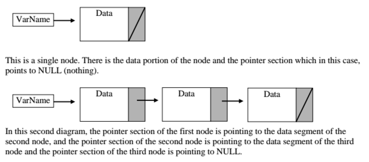

# List Implementations Continued

## Assignment
+ [AdaGold/list-implementations-cont](https://github.com/AdaGold/list-implementations-cont)

# Linked Lists

## Notes
A Linked List is a dynamic data structure that allows you to create a storage space that is capable of growing or shrinking in size. Additionally, information stored in a Linked List is stored **non-contiguously** and **space is only used as it is needed**. This contrasts a native array, where information is stored contiguously in memory and the size is fixed when instantiated.

A linked list is **a collection of nodes**.

A node typically has two parts:
  1) data (a single String, hash, fixnum, Object, etc...)
  2) a pointer to another node or `nil` (a pointer without a target – essentially goes nowhere)

When we visualize a linked list, our drawings usually look like this:



What you may be wondering is how we can access the data in an individual node of a linked list. **One limitation of a Linked List is that we have to access the data in linear order.** So in order to access data, we must start at the beginning of the list (the "**head**") and move down the list until we run out of nodes, using a **temporary pointer to keep track of our current position in the list**.


So if we had a linked list like the one above, in order to print all the elements in the linked list, we might follow a procedure like:

```
Create variable TRAVERSE to point at the node linky
WHILE TRAVERSE isn't nil (the end of the linked list)
  Print out the data stored in TRAVERSE's current node.
  Move TRAVERSE to the next node
END WHILE
```


### Different Types of Linked Lists
There are different types of linked lists.

The most basic looks like what is describe above and is called a **singly linked list**. Each node has exactly one successor node, except for the last node, which points to `nil`. Each node has exactly one predecessor node, except for the first node (the "head" or "front" of the list), which has no predecessor.

There are also **doubly linked lists**, which are much like singly linked lists, except that they also point backwards. So doubly linked lists have both a `next` and a `prev` pointer.


There are also **circularly linked lists**, which can either be singly or doubly linked, but the end of the list points back to the first item in the list. In this case, every node has exactly one predecessor and one successor node.


### A closer look at Linked List methods
Given that every `Node` should have `data` and `next` (sometimes these exact variable names are different), let's look at what pseudocoding an `add` and `delete` method might look like:

ADD
```
  IF the linked list is empty
    create the first node and give it the value passed in
    update size, if tracking
  ELSE
    (traverse to the end of the list and insert a new node with the passed value by:)
    create a pointer (current) to the head node

    WHILE current has a node after it
      set current to be the node after current
    END WHILE

    add a new node to the end of the list (now current)
    update size, if tracking
  END IF/ELSE
```

DELETE
```
  IF the list is empty
    return nil/null --> something to exist the method
  END IF
  IF the data you want to delete is in the head node
    make head point to head's next
    update size, if tracking
  ELSE
   create a pointer (previous) to point at head
   create a pointer (current) to point at head's next

   WHILE there's a current node to process AND current's data isn't what we want to delete
     set previous to previous's next
     set current to current't next
   END WHILE

   IF the current node isn't nil/null (meaning a node was found to delete)
    (jump over the node to be deleted by:)
    setting previous's next to current's next
    update size, if tracking
   END IF
  END IF/ELSE
```

PRINT (ruby: to_s)
```
  IF the list is empty
    return "[]"
  END IF

  create a string to hold the string version of the list (toReturn)
  (traverse through the list till you hit the "nil" at the end by:)
  create a pointer (current) to point at head

  WHILE there's a current node to process
    add the current node's data to toReturn + "-->"
    set current to current't next
  END WHILE

  remove the last "-->"
  return the built string (toReturn)
```

### Adding to a Linked List

The add method outlined above always adds to the end of the list. Is this the most efficient way to add to a Linked List? (A: no). Because adding to the end of a list requires us to visit every node in the list, it is O(n) to add to the end of a list.

But what if we added to the front of the list instead? We could do the following, which would be constant time because we wouldn't need to traverse through the linked list at all.

ADD O(1)
```
set head equal to a new node(passed value, old head)
```

Both of these methods maintain some sort of ordering based on how the data is inserted into the linked list. But what if we wanted our list to maintain numerical sorted order? Then what?! Perhaps:

ADD (maintaining sorted order)
```
  IF the linked list is empty
    create the first node and give it the value passed in
    update size, if tracking
  ELSE IF the data to be inserted belongs in front of the head node
    set head equal to a new node(passed value, old head)
  ELSE
    create a pointer (current) to the head node

    WHILE current has a node after it && current's next's data is smaller than the data passed
      set current to be the node after current
    END WHILE

    set current's next to be a new node(passed value, old current's next)
  END IF/ELSE
  update size, if tracking
```

