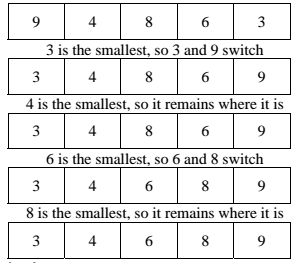
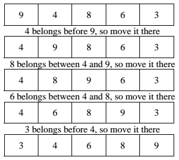

# Sorting
<!--
## Presentation
+ [Sorting and Efficiency](https://drive.google.com/open?id=1elJdFGo1ZcEI8rcmWgbSUFS33b-DoB2z_cA1yRaM1ec)
-->
<!--
## Assignment
+ [AdaGold/big-o](https://github.com/AdaGold/big-o)
-->
## Homework before class
Before our next class, read the lecture notes below, additional notes and watch the videos from links provided.

### Notes
In our last conversation on [Arrays](https://github.com/Ada-Developers-Academy/textbook-curriculum/blob/master/04-cs-fundamentals/classroom/Arrays.md), we saw how having the data set sorted improved the algorithms we could use. e.g. <strong>Finding an element with minimum or maximum value</strong> went from a *O(n)* algorithm for unsorted array to an *O(1)* algorithm for a sorted array. Similarly, <strong>binary search</strong> which is possible on sorted data set is an *O(log n)* algorithm as compared to *O(n)* <strong>linear search</strong> algorithm. There are also other everday examples where we expect the data set to be sorted e.g. last names sorted from 'a' through 'z', words in a dictionary, test scores sorted in descending order, employee ids sorted in ascending order etc.

Sorting is ordering a list of elements. We can distinguish two types of sorting. If the number of elements is small enough to fit in the main memory, sorting is called *internal sorting*. If the number of elements is larger than can fit in the main memory, some of them will stay in the external storage while the sorting algorithm works and is called *external sorting*. For our conversation, we'll look at a few internal sorting algorithms.

#### Bubble Sort
The bubble sort algorithm is a simple sorting algorithm that repeatedly steps through the list to be sorted, compares each pair of adjacent items and swaps them if they are in the wrong order. As the algorithm proceeds, the largest element gets bubbled to the top of the array after each iteration through the outer loop. The algorithm repeats this process until it makes a pass all the way through the list without swapping any items.

```ruby
def bubble_sort(array, length)
  i = 0
  while i < length # outer loop
    j = 0
    while j < length-i-1 # inner loop
      if array[j] > array[j+1] # swap
        temp = array[j]
        array[j] = array[j+1]
        array[j+1] = temp
      end
      j += 1
    end
    i += 1
  end
end
```
<strong>Example:</strong> Consider the initial unsorted array [99, 45, 35, 40, 16, 50, 11, 7, 90]. Here's one step through the outer loop of the algorithm (i.e. while *i* is *0* and *j* ranges from *0* to *7*). The largest element, 99 gets bubbled to the top.</br>
&nbsp;&nbsp;&nbsp;&nbsp;[<strong>99, 45</strong>, 35, 40, 16, 50, 11, 7, 90]</br>
&nbsp;&nbsp;&nbsp;&nbsp;[45, <strong>99, 35</strong>, 40, 16, 50, 11, 7, 90]</br>
&nbsp;&nbsp;&nbsp;&nbsp;[45, 35, <strong>99, 40</strong>, 16, 50, 11, 7, 90]</br>
&nbsp;&nbsp;&nbsp;&nbsp;[45, 35, 40, <strong>99, 16</strong>, 50, 11, 7, 90]</br>
&nbsp;&nbsp;&nbsp;&nbsp;[45, 35, 40, 16, <strong>99, 50</strong>, 11, 7, 90]</br>
&nbsp;&nbsp;&nbsp;&nbsp;[45, 35, 40, 16, 50, <strong>99, 11</strong>, 7, 90]</br>
&nbsp;&nbsp;&nbsp;&nbsp;[45, 35, 40, 16, 50, 11, <strong>99, 7</strong>, 90]</br>
&nbsp;&nbsp;&nbsp;&nbsp;[45, 35, 40, 16, 50, 11, 7, <strong>99, 90</strong>]</br>
&nbsp;&nbsp;&nbsp;&nbsp;[45, 35, 40, 16, 50, 11, 7, 90, 99]</br>

<strong>Analysis:</strong> The time complexity of Bubble sort is *O(n^2)*
- The inner most swap conditional statement is *O(1)*
- The inner loop runs *i* times i.e. *O(i)* time complexity
- The outer loop runs from *i* = *0* to *n* i.e. 1 + 2 + 3 + ... + (n-1) = *O(n^2)*

Note: The best case time complexity for Bubble sort can be improved by optimizing this algorithm. Read further on [GeeksForGeeks: Bubble Sort](http://www.geeksforgeeks.org/bubble-sort/)

#### Selection Sort
The selection sort works by selecting the smallest unsorted item remaining in the list, and then swapping it with the item in the next position to be filled.



Selection sort has a complexity of O(n^2).

#### Insertion Sort
The insertion sort works by inserting each item into its proper place in a final list. The simplest implementation of this requires two list structures - the source list and the list into which sorted items are inserted. To save memory, most implementations use an in-place sort that works by moving the current item past the already sorted items and repeatedly swapping it with the preceding item until it is in place.



The insertion sort has a complexity of O(n^2). Unlike selection sort, insertion sort has a best case time complexity of O(n) when the items are already sorted.

+ Watch this [sorting algorithms' comparison demo](https://www.youtube.com/watch?v=ZZuD6iUe3Pc) and this [visualization](https://www.cs.usfca.edu/~galles/visualization/ComparisonSort.html)
