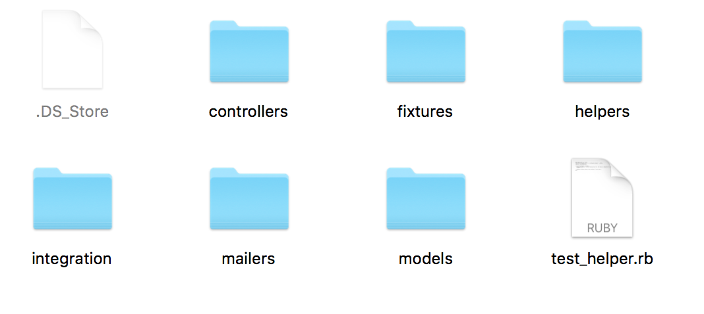

# Introduction to Testing in Rails

## Learning Goals

By the end of this lesson, students should be able to...

- Run Rails tests from the command line
- Describe the different types of tests in Rails

## Testing in Rails

As we've learned previously, the only way to know your code works is to test it. So far this has meant manual testing: whenever you make a change, you run through all the pages in your app and make sure nothing broke. However, as our Rails apps continue to grow this will quickly become untenable. We need some way to automate testing.

Fortunately Ruby on Rails was built from the ground up with testing in mind. By default, it uses the Minitest framework for testing, which means we should feel right at home.

### Finding the Tests

In the project root is a `test/` directory that houses all of our tests. Inside `test/`, tests are further organized into directories based on what kind of file they're testing. There's a directory for models, controllers, views, mailers, and helpers.

All those kinds of files serve different roles in the Rails infrastructure, so each has its own testing needs.

When we use `rails generate` commands to create files, we usually get some empty test files too. For example, `rails generate model Book` will generate both `app/models/book.rb` and `test/models/book_test.rb`.

### Running the Tests

With **Rails 5** we can run the tests with any of the following commands:

| Command                                   | Result                             |
|-------------------------------------------|------------------------------------|
| `rails test`                              | Runs all Tests                     |
| `rails test test/models`                  | Runs tests in `tests/models`       |
| `rails test test/controllers`             | Runs tests in `tests/controllers`  |
| `rails test test/controllers test/models` | Runs tests in both                 |
| `rails test test/models/book_test.rb:14`  | Run test in that file on that line |

Note that earlier versions of Rails used `rake` as the test command instead of `rails`, and you'll frequently see this syntax around the internet.

### Types of Tests

As we noticed before, Rails splits our tests into folders based on what we're testing.

#### Models

Models tend to be one of the most straightforward pieces of Rails to test. They don't typically rely on other parts of Rails, and it's relatively easy to isolate functionality. This is one of the reasons you're strongly recommended to move as much logic as you can to the model - it makes it easier to test.

Moreover, models are the closest thing to the kind of Ruby code we wrote before we got to Rails, so the types of test we write for models should feel very familiar. For these reasons, we'll start our exploration of testing in Rails with models.

When testing a model, you can imagine that you're working in the controller or on the rails console. You'll want to write tests that ask questions like these:

- Are my model relations set up as I expected?
- Do my validations catch invalid models, and let valid ones through?
- Do my custom methods return the correct data?

#### Controllers

Because controller actions tend to do a lot of work and rely on many other components of Rails (like models and views), testing them is a little less straightforward.

Questions you'll want to ask with your controller tests include:

- Can I send a GET request for the books index?
- What happens when I try to show a book that doesn't exist?
- When I POST a new book, is that book actually added to the database?
- What happens when I POST a book with invalid attributes?

Rails has a set of custom assertions to aid you in asking these questions. We'll learn all about those when we study controller testing later this week.

#### Views

You'll note that Rails does not generate a `test/views` folder. This is because testing generated HTML is really hard! There are tools out there that will aid you in doing so, but they tend to be expensive, hard to set up and fickle to maintain, and are definitely beyond the scope of this course.
