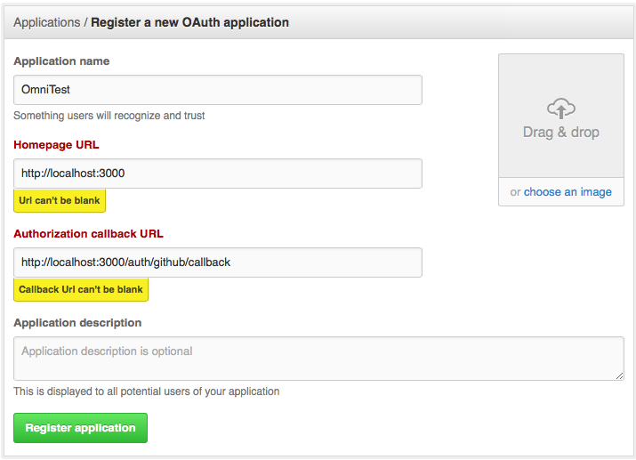
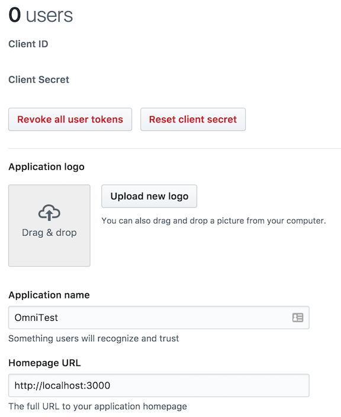

# Session && OAuth
## Learning Goals
- Discover what's really happening when we "Sign in with Facebook" (or any other 3rd party provider)
- Understand the basic workflow of OAuth, and how it protects users
- Implement user login/logout using Github as an _OAuth provider_
- What is an environment variable?
- How do we deal with needing to know data _across_ multiple HTTP requests?

## Authentication with OmniAuth
[OmniAuth](https://github.com/omniauth/omniauth) is a Ruby gem that standardizes the authentication process. It uses the [OAuth](https://oauth.net/) protocol for authenticating users. OAuth is an open standard for authorization, commonly used as a way for users to log in websites using 3rd-party credentials (like Google, Facebook, Twitter, etc) without exposing their password.

The `OmniAuth` gem provides pretty much everything you need to use OAuth to authenticate users. It starts by adding new routes to your application:

- `/auth/:provider`
- `/auth/:provider/callback`

In both of these examples `:provider` is a named parameter that will equal the name of the service we are using (`github`, in this example). These two routes are how to start and end the authentication interaction with the provider. Sending the user to `/auth/github`, will start the authentication process. When authentication is complete, Github will redirect the user to `/auth/github/callback`. It goes something like this:


### Installing OmniAuth
Enough with talking, lets implement this into a quick application. Head over to your sandbox Rails app and open your Gemfile. Add the following lines to it:

```ruby
gem "omniauth"
gem "omniauth-github"
```

Save your Gemfile, then head over to your terminal, where you'll need to `$ bundle`. Notice that there's a specific gem for autheticating with Github. Each _provider_ has a small Ruby gem that's responsible for the specifics of how to authenticate with that service.

### Github Credentials
Each provider requires you to provide some credentials for your application, so they can keep track of which website is authorizing which user. [Login to Github and register a new "application"](https://github.com/settings/applications/new).



After registration you will be given a `client id` and a `client secret`:



**Note:** These credentials are the equivalent of passwords to your Github account. Keep them safe; never, ever post them in public places or commit them in git.

#### Storing Credentials
Because they cannot be committed to git, the Github application credentials must be loaded external of the Rails application. The most common way to do this is to create a file called `.env` in the project root. Dot files (called that because they start with a dot) are typically excluded from version control and are well suited for secrets. __NEVER COMMIT A `.env` TO GIT!__

To use a `.env` with Rails, head back to the Gemfile. Add `gem 'dotenv-rails'` to the `:development` group in the Gemfile:

```ruby
#Gemfile
group :development, :test do
  # Call 'byebug' anywhere in the code to stop execution and get a debugger console
  gem 'byebug'
  gem 'dotenv-rails'
end
```

Then head to the terminal for Yet Another Bundle® (`$ bundle`).

__QUESTION:__ Why add it to the `:development` group? Why's it matter?

Next, before we create the file we will add it to our `.gitignore`. This will help prevent us from accidentally publishing it on GitHub. Open up `.gitignore` in the project root, and add these lines:

```
# Ignore the .env file (it's full of secrets!)
.env
```

Now create the `.env` file with `$ touch .env`. This file is a collection of key/value pairs; add the application credentials from Github like this:

```bash
GITHUB_CLIENT_ID: fd6XXXXXXXX
GITHUB_CLIENT_SECRET: y6wXXXXXXX
```

With that done, the Github application credentials will now be available to Rails via the `ENV` constant.

#### Accessing Credentials
Now that you have application credentials, let's configure Rails to use them. To do this, create a new _initializer file_. Initializers are files that run as part of the Rails boot process. Initializers go in the `config/initializers/` directory. From the terminal, create a new initializer with `$ touch config/initializers/omniauth.rb`. Open this file and add the following code:

```ruby
Rails.application.config.middleware.use OmniAuth::Builder do
  provider :github, ENV["GITHUB_CLIENT_ID"], ENV["GITHUB_CLIENT_SECRET"], scope: "user:email"
end
```

This tells Rails to use OmniAuth for authentication. Specifically, it tells Rails that it will be communicating with Github, and where it can find the application credentials that Github expects: in the `ENV` variable we populated earlier.

## OMG USERS FINALLY
Well, no, not yet. First Rails needs a way to manage the information it will receive from Github about the authenticating user.

Start the Rails server and point a browser at `http://localhost:3000/auth/github`. Amazingly, the request is redirected to Github to login and grant permission! After authenticating and granting, Github redirects the browser to `localhost:3000/auth/github/callback`. Here, you'll see a bunch of information in the url parameters. Let's create a route to better explore this information. Open `routes.rb` and add:

```ruby
get "/auth/:provider/callback" =>  "sessions#create"
```

This route points to a `create` action in a sessions controller. You'll need to create this controller in your terminal with `$ rails generate controller sessions`. Open it in your editor and add a `create` action that looks like this:

```ruby
class SessionsController < ApplicationController
  def create
    auth_hash = request.env['omniauth.auth']
    raise
  end
end
```

Refresh the page in the browser and have a look at `auth_hash`, the local variable assigned to the value of `request.env['omniauth.auth']`. This is information stored in the `headers` of the HTTP request. This data is a hash that will likely have some combination of the data described in the [OmniAuth README](https://github.com/intridea/omniauth/wiki/Auth-Hash-Schema), but the key/values returned varies by provider (there's lots of documentation reading in your future). Github will return the following important keys:

```ruby
# the `uid` is an identifier for the user from the provider's system
# using it plus the provider type (github in this case),
# we can uniquely identify a user
auth_hash["uid"]

# the info hash contains specifics of the user's account
auth_hash["info"]["name"]
auth_hash["info"]["email"]
```

With information returned by Github you can create a database record for uniquely identifying a user.

### Modeling Users
Start with a `User` model and migration: `$ rails generate model user`. Open the generated migration and add some columns to the database table:

```ruby
class CreateUsers < ActiveRecord::Migration
  def change
    create_table :users do |t|
      t.string :name
      t.string :email
      t.integer :uid, null: false # this is the identifier provided by Github
      t.string :provider, null: false # this tells us who provided the identifier

      t.timestamps null: false
    end
  end
end
```

Remember to migrate the database: `$ rake db:migrate`. Next add some validations to the User model:

```ruby
# app/models/user.rb
class User < ActiveRecord::Base
  validates :email, :uid, :provider, presence: true

  def self.build_from_github(auth_hash)
    user       = User.new
    user.uid   = auth_hash[:uid]
    user.provider = 'github'
    user.name  = auth_hash['info']['name']
    user.email = auth_hash['info']['email']

    return user
  end
end
```

### Handling the Auth Callback
Now everything is in place to initialize a User using the hash that is returned from the provider request:

```ruby
# app/controllers/sessions_controller.rb
# NOTE: this version is not final
class SessionsController < ApplicationController
  def create
    auth_hash = request.env['omniauth.auth']
    redirect_to login_failure_path unless auth_hash['uid']

    @user = User.find_by(uid: auth_hash[:uid], provider: 'github')
    if @user.nil?
      # User doesn't match anything in the DB.
      # Attempt to create a new user.
      @user = User.build_from_github(auth_hash)
      render :creation_failure unless @user.save
    end

    redirect_to sessions_path
  end
end
```

Now that we've successfully authenticated a user and built a database entry for them, what happens next? The login ought to be _persistent_ - that is, the user should be logged in as long as they are on the site, even if they move from page to page. Moreover, we don't want to embed the user ID in the URI, since then you could impersonate a user just by changing the address.

#### The `session` Object
The `session` is a hash-like-object similar to `params`. The key difference between `session` and `params` is that `session` _persists across requests_.

Sessions use a _cookie_ in the browser to identify each unique session. Each client request sends along its unique session identifier, from which Rails can recall existing session data. Session data is, by necessity, very small (typically less than 4kb).

The most common use of `session` is to store the id of an authenticated user. From within a controller, we can get and set `session` keys using the familiar hash access syntax:

```ruby
# app/controllers/sessions_controller.rb
class SessionsController < ApplicationController
  def create
    auth_hash = request.env['omniauth.auth']
    redirect to login_failure_path unless auth_hash['uid']

    @user = User.find_by(uid: auth_hash[:uid], provider: 'github')
    if @user.nil?
      # User doesn't match anything in the DB.
      # Attempt to create a new user.
      @user = User.build_from_github(auth_hash)
      render :creation_failure unless @user.save
    end

    # Save the user ID in the session
    session[:user_id] = @user.id

    redirect_to sessions_path
  end

  def index
    @user = User.find(session[:user_id]) # < recalls the value set in a previous request
  end
end
```

Before the `session` is sent to the browser it is encrypted. This means its contents are _opaque_ to the browser. All the browser sees is several KB of garbled nonsense, which it can neither interpret nor change. This makes the `session` ideal for things like storing the ID of an authenticated user, since there's no way for a malicious browser to fake a login.

## Additional Resources
[Sessions, Cookies and Authentication ](http://www.theodinproject.com/courses/ruby-on-rails/lessons/sessions-cookies-and-authentication)(not including 'Rolling Your Own Auth')  
[How Sessions Work](http://www.justinweiss.com/articles/how-rails-sessions-work/)  
[Rails Guides: Accessing the Session](http://guides.rubyonrails.org/action_controller_overview.html#accessing-the-session)
[How to Set Environment Variables in Heroku](https://devcenter.heroku.com/articles/config-vars)
