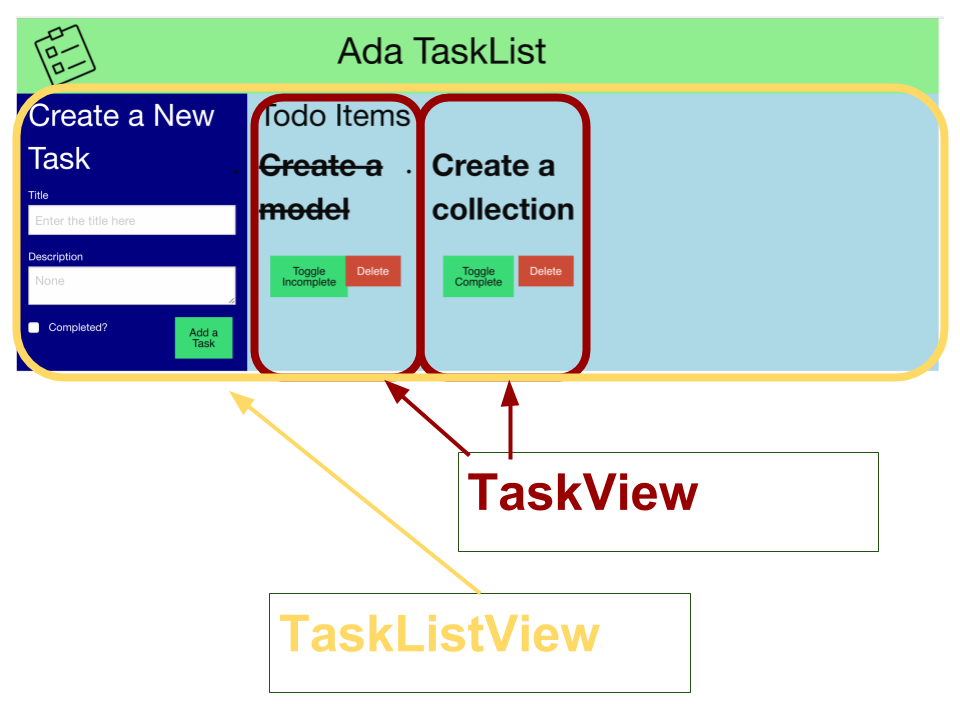
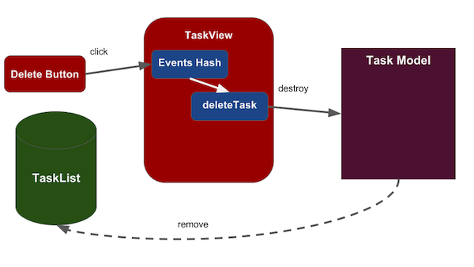
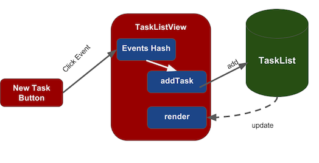

# Intro to Backbone Views

## Learning Goals
By the end of this lesson you should be able to:

- Explain what Backbone views are and why they're useful
- Create a view around a Backbone Model
- Render HTML using a view & an Underscore Template
- Create a view for a Backbone Collection
- Render a collection with a view

## What is a View?
Backbone views are kind of middle-managers in the Backbone world, filling a similar role to controllers in Rails. A view's job is to coordinate between the data and the DOM. When a DOM event happens, it's the view's job to handle it and update the data as needed, and when the data changes it's the view's job to modify the DOM to match.

You may have noticed in the, previous lectures, we have a jumble (technical term) of functions handling events, and drawing the tasklist to the browser etc.  This could quickly become a mess.  It's time for some structure!

We will first create two views, one for a single task item and a second for the collection of Tasks.  Each view will handle drawing and event handling for it's specific domain, and the view for the collection will utilize the smaller TaskView.  


You can see a deployed version of this app [here:](http://cheezitman.github.io/tasklist-js)

## Creating A TaskView



A TaskView will handle drawing an individual task item and responding to events that concern just that task.  To start we create a file in `app/views/task_view.js`  Each TaskView will only be concerned with rendering a specific task and dealing with events on that task.  We've indicated it in red in the image above.  


```JavaScript
import Backbone from 'backbone';
import _ from 'underscore';
import $ from 'jquery';
import Task from '../models/task.js';

var TaskView = Backbone.View.extend({
  initialize: function(params) {
    this.template = params.template;
  },
  render: function() {
    var compiledTemplate = this.template(this.model.toJSON());
    this.$el.html(compiledTemplate);
    return this;
  }
});

export default TaskView;
```

Just like Models and Collections a view extends `Backbone.View`.  This model has 4 important properties, `initialize`, `render` `el`, & `model`.

|   Property	|   Description	|
|---	|---	|
|   `initialize`	|   A function, like in a Ruby class, called immediately when a new Backbone object is created, View, Model or Collection. 	|
|   `el`	|   An HTML DOM element that, by default, is an empty `div`.  We use `el` to insert our view into the page when it is rendered.  	|
|   `$el`	|   A jQuery selection of `el`, and you can use jQuery functions on it.  With `$el` you can run jQuery selections for HTML elements inside, and only inside the view.  For example, `$el.find('button.delete')` is jQuery selection of button with the class `delete` inside of `el` (the view). 	In other words `myView.$el` and `$(myView.el)` are equivalent.  |
|   `model`	|   The Backbone model which provides the data for the view.  The view's `model` can be a Backbone Model or Collection.  Each View should, in general, have **one** `model`.    	|
|   `render`	|   A function called to draw (or redraw) the view.  By convention the render function always returns `this` so that it can be chained with other methods.  |


## Adding our view to `app.js`

We can update our renderList method to use the new view to draw each element.  Instead of calling the render method we created in `app.js` we create a new TaskView with the given model & template.

Then we render the template and append the resulting `$el` to the DOM.  

```javascript
// app.js
// imports etc...
import TaskView from './views/task_view.js';

var renderList = function(taskList) {
  // Clear the unordered list
  $('.todo-items').empty();
  
  // Iterate through the list rendering each Task
  taskList.each(function(task) {
  
    // Create a new TaskView with the model & template
    var taskView = new TaskView({
      model: task,
      template: _.template($('#taskItemTemplate').html()),
      tagname: 'li'
    });
    
    // Then render the TaskView
    // And append the resulting HTML to the DOM.
    $('.todo-items').append(taskView.render().$el);
  });
};
```

Notice that in the code above we used `taskView.render().$el`.  We can do this because the view's `render()` method returns a reference to the view with the line `return this;`.  It is convention in Backbone to always have the `render()` method return `this` exactly so that we can do this kind of chaining.  We also set the tagName that we are using for `el` to be `li` or a list item.

We are performing many of the same operations we performed in our `app.js` file's `render` function as we create the `TaskView` and render it.

## DOM Events & Views

Switching to using views has rendered the delete button inoperative.  Backbone however provides a way to configure a View to respond to DOM events, like clicking on our delete button.  To do so we create an events object with the event description as the key and an event handling method.  Below we can add an events hash with our click event and an event handling method.  

So when the user clicks a delete button inside the view, Backbone will check the events hash and match the event with an event handler function.  Then that function will call the model's `destroy()` function.  The model will then remove itself from all collections.  Once the model is removed from the collection the Collection will trigger an, "update" event which will cause our `app.js` file's `renderList` function.  



```javascript
//...
}, // render
  events: {
    'click button.alert': "deleteTask"
  },
  deleteTask: function(e) {
    this.model.destroy();
  }
}};
```


Destroying the model triggers the "update" event in the collection and re-renders the collection.

## Exercise

Now try to add another event yourself toggling the task between complete or incomplete using the model method you made earlier.  You will also need to finish the event handler by calling `render()` to draw the updated Task.

You can see a working version [here](https://gist.github.com/CheezItMan/ebd6a77aab299aa247ea3e9b1164dd1a).


## Creating a View for TaskList

Now we can create a view to manage the entire TaskList.  This includes everything we have on the site to manage the tasks including the form to add a new task to the list.  If you examine the image above the TaskListView's area of concern is indicated in green.  

This view starts like `TaskView` with a file named `/src/views/task_list_view.js`.  We can move our renderList code into the view's render method and make a few adjustments.

```javascript
import Backbone from 'backbone';
import _ from 'underscore';
import $ from 'jquery';
import TaskView from '../views/task_view.js';


var TaskListView = Backbone.View.extend({
  initialize: function(params) {
    this.template = params.template;
  },
  render: function() {
    // Clear the unordered list
    this.$('.todo-items').empty();
    // Iterate through the list rendering each Task
    var that = this;
    this.model.each(function(task) {
      // Create a new TaskView with the model & template
      var taskView = new TaskView({
        model: task,
        template: that.template,
        tagName: 'li'
      });
      // Then render the TaskView
      // And append the resulting HTML to the DOM.
      that.$('.todo-items').append(taskView.render().$el);
    });
    return this;
  }
});

export default TaskListView;
```
Just like the `TaskView` in `initialize` we store the template in an attribute of the view.  The view's render method looks like the render method we wrote earlier with a few differences particularly with regard to `this` and `that`.

### A Note about `this` and `that`.  

If you'll notice we save our current context `this` into a variable named `that` in the render method.  We do this because the `.each` method's callback method is called within the context of the collection.  

We finish the `render` method by appending each TaskView to the list inside the DOM and when the loop is finished we `return this;` by convention.  It's a fairly common pattern developers use in JavaScript to deal with confusing `this` issues. 


### About `this.$`

In the `render` method we clear the list using `this.$`.  The method `this.$` performs a jQuery selection for HTML inside `el`.  Using `this.$` we can ensure that our view does not interact with any code outside of it.  You should never use jQuery directly within a view.  Instead you should use `this.$` just as you would jQuery to avoid impacting the DOM outside your view.  


### Updating `app.js`

We will adjust our `$(document).ready` handler to use the `TaskView`.


```JavaScript
// app.js
// imports etc...

import TaskListView from './views/task_list_view';

// ...

$(document).ready(function() {
  var taskData = [{
    title: "Create a model",
    completed: true
  },
  {
    title: "Create a collection",
    completed: false
  }];
  taskList = new TaskList(taskData);

  var taskListView = new TaskListView({
    model: taskList,
    template: _.template($('#taskItemTemplate').html()),
    el: 'main'
  });
  taskListView.render();
});
```

We create the TaskListView and set it's model to be our taskList collection and set the template attribute.  In this case we start off our View attached to an element in the DOM, in this case our `main` tag.

Lastly we call render on the taskListView.

**Wait The Delete Button Just got broken!!**  Don't worry we'll handle that shortly.  

### Handling Creating New Tasks

Just like we added event handlers in the `TaskView` to handle button clicks we can add an event handler to create a new task and a method to read from the new task form, and add them to the collection.




```javascript
// views/task_list_view.js
}, // end of render

events: {
    'click #add-task': "addTask"
  },
  readNewTaskForm: function() {
    // Get the values from the fields
    var formTitle = this.$('#title').val();
    this.$('#title').val('');
    var formDescription = this.$('#description').val();
    this.$('#description').val('');
    var formCompleted = this.$('#completed-checkbox').is(":checked");
    this.$('#completed-checkbox').prop('checked', false);

    return {
      title: formTitle,
      description: formDescription,
      completed: formCompleted
    };
  },
  addTask: function(e) {
    var taskData = this.readNewTaskForm();
    var task = new Task(taskData);
    this.model.add(task);
  }
```

Again this looks very much like what we originally wrote in `app.js`  We did change the code to use `this.$` instead of direct jQuery and called `readNewTaskForm()` as an instance method with `this.`.  

**Note you will need to delete the original event handlers in `app.js`.**

**Gah!** The Add button ALSO doesn't work anymore!

Good point, the delete and add buttons are actually working, and tasks are getting added and removed from the collection, but the problem is we're not re-rending the list.

## Adding a Backbone Event Listener

If we add an event listener to the collection we can call render when the collection is updated.  

Similar to `on` we can use a method called `listenTo` to add an event listener for our collection.  We will do so in the `initialize` method.

```javascript
  initialize: function(params) {
    this.template = params.template;

    this.listenTo(this.model, "update", this.render);
  },
```

## Last bit, adjusting styles

You may have noticed that the styling is a bit broken.  That's because the `li` tag we set in the `TaskView`  doesn't have any classes added to it for styling.  

**NOTE** this is for `task_view.js` not `task_list_view.js`.  


```javascript
// src/views/task_view.js

  initialize: function(params) {
    this.template = params.template;
    
    this.listenTo(this.model, "update", this.render);
    
	 // Add classes for styling
    this.$el.addClass("task-item");
    this.$el.addClass("column");
    this.$el.addClass("column-block");
  },
```

We also need to make one adjustment by removing the `li` tag from the HTML template.

## Summary

So now we have a solution which displays our list of tasks, lets us toggle them complete or incomplete, delete and create tasks.  The view acts as a coordinator handling events and coordinating the response with the template & the model.  


## Optimizations & Extensions

What could we do to improve on this?  There are a few things we could change.  Noice we recreate all the `TaskView`s every time the `TaskListView` is rendered.  We could store them in an array to avoid recreating them.  We could also create some way to expand a task, viewing it's description when clicked on.  

## Last Note on Coding Style

Also notice that we only used `$el` to select items inside a view.  Views should never use jQuery directly `$()`, but rather use `$el` to ensure that we only select items within the view.  Some developers make an exception for selecting templates.  

## What Did We Accomplish?
- Create a basic Backbone view to display a task. It had one function:
  - `initialize()` is run once to set everything up
  - `render()` generates HTML, and may be run many times
- Use the underscore templating engine to separate concerns and clean up our rendering code.
- Added event handler methods to respond to click events.
- Create a more complex Backbone view to manage our whole collection

## Additional Resources
- [Backbone View Documentation](http://backbonejs.org/#View)
- [Backbone Applications Intro to Views](https://addyosmani.com/backbone-fundamentals/#views-1)
- [Underscore documentation](http://underscorejs.org/)
- [SitePoint Underscore tutorial](https://www.sitepoint.com/getting-started-with-underscore-js/)
